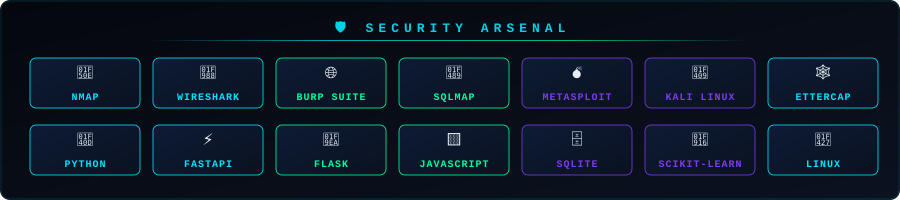

<div align="center">

<!-- ══════════════════════════════════════════════════════════════ -->
<!--                    CYBER HERO BANNER                         -->
<!-- ══════════════════════════════════════════════════════════════ -->

<picture>
  <source media="(prefers-color-scheme: dark)" srcset="./assets/cyber-hero.svg">
  
</picture>

</div>

<br/>

<!-- ══════════════════════════════════════════════════════════════ -->
<!--                     INTRODUCTION                             -->
<!-- ══════════════════════════════════════════════════════════════ -->

<table align="center" border="0" cellspacing="0" cellpadding="0">
<tr>
<td width="65%" valign="top">

## 🛡️ Khushi Singla

Cybersecurity student exploring **ethical hacking**, **offensive security**, **network security**, and practical security tooling. Building hands-on projects that apply real attack methodologies and defense techniques — from network reconnaissance to ML-based threat detection.

> 🎯 *Currently focused on penetration testing fundamentals, web application security, and building Python-based security tools.*

</td>
<td width="35%" valign="top" align="center">

<br/>


[](https://linkedin.com/in/khushi-singla)
[](https://github.com/Khushi200292)

</td>
</tr>
</table>

<br/>

<div align="center"></div>

<br/>

<!-- ══════════════════════════════════════════════════════════════ -->
<!--                    TERMINAL PROFILE                          -->
<!-- ══════════════════════════════════════════════════════════════ -->

<div align="center">

## ⚡ SECURITY PROFILE

</div>

```bash
khushi@kali:~$ python security_profile.py
```

```json
{
  "name"           : "Khushi Singla",
  "role"           : "Cybersecurity Student",
  "focus"          : [
                       "Ethical Hacking",
                       "Offensive Security",
                       "Network Security",
                       "Penetration Testing",
                       "ML-Based Threat Detection"
                     ],
  "primary_lang"   : "Python",
  "environment"    : "Kali Linux",
  "frameworks"     : ["FastAPI", "Flask", "scikit-learn"],
  "current_study"  : ["Web Application Security", "Red Team Fundamentals", "Burp Suite"],
  "experience"     : "Cryptus Cyber Security Pvt. Ltd. — Intern",
  "career_goal"    : "Aspiring Red Team Professional",
  "status"         : "🟢 Open to Cybersecurity Internships & Opportunities"
}
```

```bash
khushi@kali:~$ █
```

<br/>

<div align="center"></div>

<br/>

<!-- ══════════════════════════════════════════════════════════════ -->
<!--                    SECURITY ARSENAL                          -->
<!-- ══════════════════════════════════════════════════════════════ -->

<div align="center">



</div>

<br/>

<div align="center"></div>

<br/>

<!-- ══════════════════════════════════════════════════════════════ -->
<!--                  FEATURED SECURITY PROJECTS                  -->
<!-- ══════════════════════════════════════════════════════════════ -->

<div align="center">

## 🚀 FEATURED SECURITY PROJECTS

</div>

<table align="center" border="0" cellspacing="0" cellpadding="8" width="100%">
<tr>

<!-- Project Card 1: Advanced Port Scanner -->
<td width="50%" valign="top">

```
╔══════════════════════════════════════╗
║  🔎  ADVANCED PORT SCANNER          ║
╚══════════════════════════════════════╝
```

**Network Reconnaissance & Enumeration Tool**

A modular, multi-threaded Python security tool designed for authorized network reconnaissance and service enumeration.

**Verified Features:**
- ⚡ Fast multi-threaded TCP port scanning
- 🌐 HTTP security header analysis
- 🔐 TLS certificate inspection
- 🖥️ Basic OS detection via TTL
- 🏷️ Banner grabbing & service detection
- 📊 Risk assessment & scan summary
- 🧩 Modular architecture (`services/` directory)

**Stack:** `Python 3.10+` `socket` `threading` `ssl` `requests`

**Status:** 🔵 Completed Learning Project

> ⚠️ *For authorized testing and controlled lab environments only.*

[](https://github.com/Khushi200292/AdvancePortScanner)

</td>

<!-- Project Card 2: Phishing Detection System -->
<td width="50%" valign="top">

```
╔══════════════════════════════════════╗
║  🎣  PHISHING DETECTION SYSTEM      ║
╚══════════════════════════════════════╝
```

**ML-Powered Phishing URL Classifier**

A machine learning system that classifies URLs as phishing or legitimate. Uses real-world phishing datasets and trained ML models.

**Verified Features:**
- 🤖 Trained ML classifiers (Naive Bayes + additional model)
- 📊 Real-world phishing URL dataset (31MB CSV)
- 🔬 Jupyter Notebook research & analysis
- 🌐 Flask web interface for URL checking
- 💾 Serialized `.pkl` model & vectorizer

**Stack:** `Python` `scikit-learn` `Flask` `Jupyter` `pandas`

**Status:** 🔵 Completed Learning Project

[](https://github.com/Khushi200292/Building_an_Phishing_Detection_System)

</td>

</tr>
</table>

<br/>

<div align="center"></div>

<br/>

<!-- ══════════════════════════════════════════════════════════════ -->
<!--                      OTHER PROJECTS                          -->
<!-- ══════════════════════════════════════════════════════════════ -->

<div align="center">

## 💻 OTHER PROJECTS

</div>

<table align="center" border="0" cellspacing="0" cellpadding="8" width="100%">
<tr>

<!-- Multi-threaded Port Scanner -->
<td width="50%" valign="top">

**🔎 Multithreaded TCP Port Scanner**

Python-based concurrent port scanner — foundational networking and threading project.

- TCP port range scanning with threading
- Supports both IP addresses and hostnames
- Queue-based thread management
- Graceful error handling

`Python` `socket` `threading` `queue` `IPy`

**Status:** 🟡 Learning Project

[](https://github.com/Khushi200292/Multi-threaded-Port-Scanner)

</td>

<!-- GPS Tracking System -->
<td width="50%" valign="top">

**🌍 Real-Time GPS Tracking System**

Real-time location tracking system project — demonstrates broader development experience beyond cybersecurity.

- Real-time GPS coordinate tracking
- Map integration
- Live data updates

**Status:** 🔵 Completed

[](https://github.com/Khushi200292/Building_an_real_time_gps_traking_system)

</td>

</tr>
</table>

<br/>

<div align="center"></div>

<br/>

<!-- ══════════════════════════════════════════════════════════════ -->
<!--                  CYBERSECURITY LEARNING PATH                 -->
<!-- ══════════════════════════════════════════════════════════════ -->

<div align="center">

## 🧠 CYBERSECURITY LEARNING PATH

</div>

<div align="center">

```
  🔎 RECONNAISSANCE          ←  Nmap · Network Scanning · OSINT
          │
          ▼
  🌐 WEB APPLICATION SECURITY ←  Burp Suite · SQL Injection · XSS
          │
          ▼
  🧪 VULNERABILITY ASSESSMENT ←  Service Enumeration · Risk Analysis
          │
          ▼
  ⚔️  PENETRATION TESTING     ←  Methodology · Controlled Labs
          │
          ▼
  💣 EXPLOITATION             ←  Metasploit · Python Exploits
          │
          ▼
  🛡️  DEFENSIVE ANALYSIS      ←  Threat Detection · Behavioral Analysis
          │
          ▼
  🎯 RED TEAM OPERATIONS      ←  Active Learning Goal
```

> *This path represents my learning direction — not claimed mastery of every stage.*

</div>

<br/>

<div align="center"></div>

<br/>

<!-- ══════════════════════════════════════════════════════════════ -->
<!--                    CURRENTLY LEARNING                        -->
<!-- ══════════════════════════════════════════════════════════════ -->

<div align="center">

## 📚 CURRENTLY LEARNING

</div>

<div align="center">

| Area | Topics |
|------|--------|
| 🌐 **Web Security** | SQL Injection · XSS · CSRF · Burp Suite |
| 🔎 **Reconnaissance** | Nmap scripting · OSINT techniques |
| ⚔️ **Penetration Testing** | Methodology · Kali Linux tooling |
| 🛡️ **Threat Detection** | Behavioral analysis · ML-based detection |
| 🐧 **Linux Security** | Kali Linux · privilege escalation basics |
| 🎯 **Red Team Fundamentals** | Attack simulation · controlled lab practice |

</div>

<br/>

<div align="center"></div>

<br/>

<!-- ══════════════════════════════════════════════════════════════ -->
<!--                     SECURITY LABS                            -->
<!-- ══════════════════════════════════════════════════════════════ -->

<div align="center">

## 🧪 SECURITY LABS & PRACTICE

</div>

<div align="center">

```
┌──────────────────────────────────────────────────────────────┐
│  LAB ENVIRONMENT                                             │
│                                                              │
│  🐉 Kali Linux — Primary attack platform                    │
│  🌐 Burp Suite — Web application testing                    │
│  🔎 Nmap — Network reconnaissance practice                  │
│  💣 Metasploit — Exploitation framework study               │
│  💉 SQLMap — Automated SQL injection testing                │
│  🧪 Controlled lab environments — authorized targets only   │
└──────────────────────────────────────────────────────────────┘
```

</div>

<br/>

<div align="center"></div>

<br/>

<!-- ══════════════════════════════════════════════════════════════ -->
<!--                      EXPERIENCE                              -->
<!-- ══════════════════════════════════════════════════════════════ -->

<div align="center">

## 💼 EXPERIENCE

</div>

<div align="center">

```
╔════════════════════════════════════════════════════════════╗
║  🏢  Cryptus Cyber Security Pvt. Ltd.                     ║
║  📋  Cybersecurity Intern                                  ║
║  🔐  Cybersecurity domain — practical industry exposure    ║
╚════════════════════════════════════════════════════════════╝
```

</div>

<br/>

<div align="center"></div>

<br/>

<!-- ══════════════════════════════════════════════════════════════ -->
<!--                    CERTIFICATIONS                            -->
<!-- ══════════════════════════════════════════════════════════════ -->

<div align="center">

## 🏆 CERTIFICATIONS & LEARNING

</div>

<div align="center">

| Certificate | Provider | Domain |
|-------------|----------|--------|
| 🤖 Introduction to Generative AI | Simplilearn | AI/ML |

</div>

<br/>

<div align="center"></div>

<br/>

<!-- ══════════════════════════════════════════════════════════════ -->
<!--                    GITHUB ANALYTICS                          -->
<!-- ══════════════════════════════════════════════════════════════ -->

<div align="center">

## 📊 GITHUB ANALYTICS

</div>

<div align="center">


&nbsp;


</div>

<div align="center">

[](https://github.com/Khushi200292)

</div>

<br/>

<div align="center"></div>

<br/>

<!-- ══════════════════════════════════════════════════════════════ -->
<!--                  CONTRIBUTION ACTIVITY                       -->
<!-- ══════════════════════════════════════════════════════════════ -->

<div align="center">

## 📈 CONTRIBUTION ACTIVITY

[](https://github.com/Khushi200292)

</div>

<br/>

<div align="center"></div>

<br/>

<!-- ══════════════════════════════════════════════════════════════ -->
<!--                     LET'S CONNECT                            -->
<!-- ══════════════════════════════════════════════════════════════ -->

<div align="center">

## 📫 LET'S CONNECT

*Open to cybersecurity internships, collaborative security projects, and learning opportunities.*

<br/>

[](https://linkedin.com/in/khushi-singla)
&nbsp;
[](https://github.com/Khushi200292)
&nbsp;
[](mailto:khushisingla509@gmail.com)

</div>

<br/>

<div align="center"></div>

<br/>

<!-- ══════════════════════════════════════════════════════════════ -->
<!--                         FOOTER                               -->
<!-- ══════════════════════════════════════════════════════════════ -->

<div align="center">

```
  ⚡  LEARN • BUILD • SECURE  ⚡
```

*"Security is not a product, but a process."*


</div>
